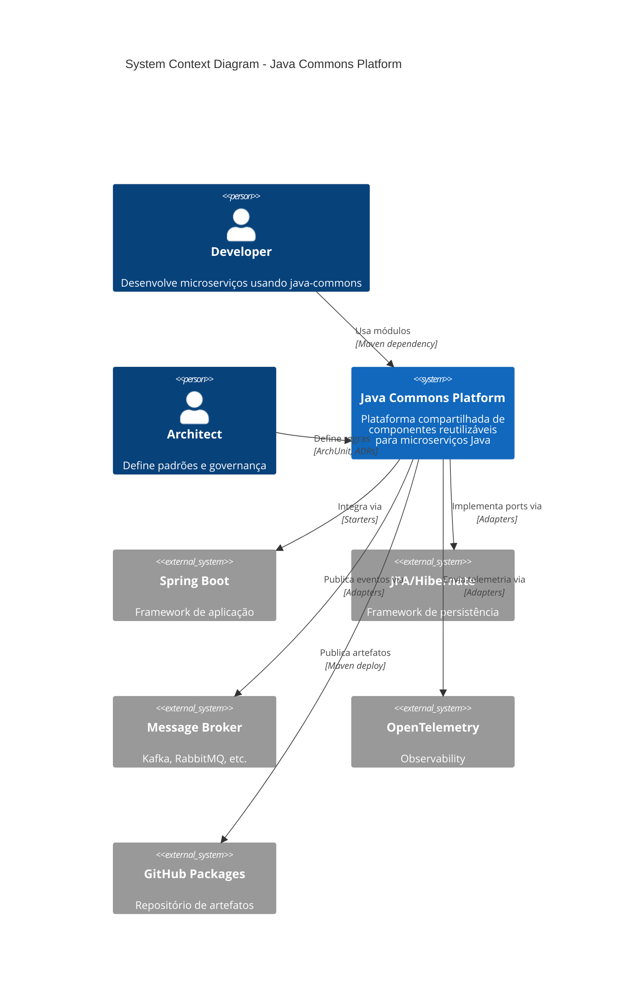
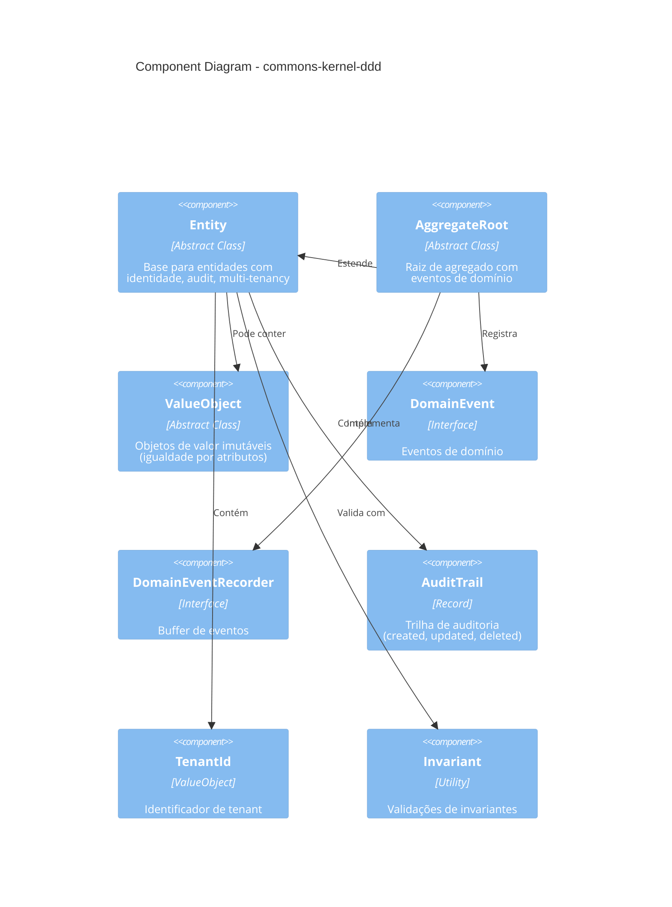
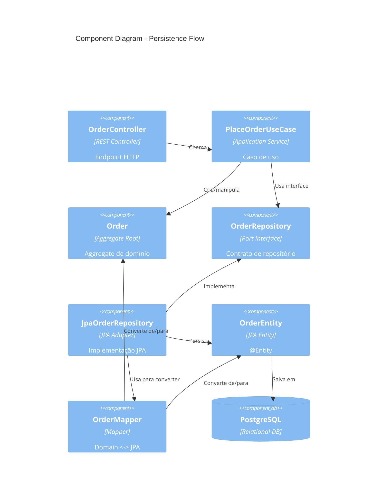
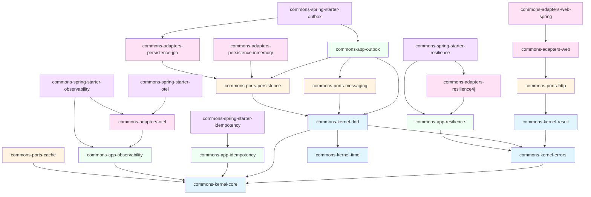

# Diagramas C4: Java Commons Platform

Este documento contém diagramas C4 (Context, Container, Component) da arquitetura do java-commons.

> **Sobre C4**: O modelo C4 (Context, Containers, Components, Code) é uma abordagem para visualização de arquitetura de software criada por Simon Brown.

## Nível 1: Context Diagram

**Visão de alto nível**: Como java-commons se relaciona com usuários e sistemas externos.



## Nível 2: Container Diagram

**Módulos principais**: Containers lógicos (módulos Maven) que compõem a plataforma.

```mermaid
C4Container
    title Container Diagram - Java Commons Platform
    
    Container_Boundary(starters, "Spring Boot Starters") {
        Container(starter_obs, "Observability Starter", "Spring Boot AutoConfig", "Auto-configura correlation ID,<br/>logging, tracing")
        Container(starter_res, "Resilience Starter", "Spring Boot AutoConfig", "Auto-configura circuit breaker,<br/>retry policies")
        Container(starter_outbox, "Outbox Starter", "Spring Boot AutoConfig", "Auto-configura Transactional Outbox")
    }
    
    Container_Boundary(adapters, "Adapters") {
        Container(adapter_web, "Web Adapters", "Spring MVC/WebFlux", "Controllers REST, exception handlers")
        Container(adapter_jpa, "JPA Adapters", "Hibernate", "Repositórios concretos")
        Container(adapter_otel, "OTel Adapter", "OpenTelemetry SDK", "Tracing, metrics implementation")
    }
    
    Container_Boundary(ports, "Ports") {
        Container(port_persist, "Persistence Ports", "Interfaces", "Repository<E,ID>,<br/>PageableRepository")
        Container(port_msg, "Messaging Ports", "Interfaces", "MessagePublisher,<br/>MessageConsumer")
        Container(port_http, "HTTP Ports", "Interfaces", "HttpClient")
    }
    
    Container_Boundary(app, "Application") {
        Container(app_obs, "Observability App", "Use Cases", "Correlation context,<br/>request tracking")
        Container(app_outbox, "Outbox App", "Transactional Outbox", "Event persistence & polling")
        Container(app_idempotency, "Idempotency App", "Deduplication", "Idempotency handling")
    }
    
    Container_Boundary(kernel, "Kernel (Domain)") {
        Container(kernel_ddd, "DDD Kernel", "Pure Java", "Entity, AggregateRoot,<br/>ValueObject, DomainEvent")
        Container(kernel_result, "Result Kernel", "Pure Java", "Result<T,E>, Option<T>")
        Container(kernel_errors, "Errors Kernel", "Pure Java", "Error hierarchy")
    }
    
    Rel(starters, adapters, "Configura beans")
    Rel(adapters, ports, "Implementa")
    Rel(app, ports, "Usa")
    Rel(app, kernel, "Orquestra")
    Rel(ports, kernel, "Retorna tipos de")
```

## Nível 3: Component Diagram - Kernel DDD

**Componentes internos**: Classes principais dentro do módulo `commons-kernel-ddd`.



## Nível 3: Component Diagram - Persistence

**Fluxo de persistência**: Como os componentes de persistência se relacionam.



## Diagrama de Dependências entre Módulos



## Legendas

### Camadas

- 🔵 **Kernel** (Azul): Domínio puro, framework-free
- 🟡 **Ports** (Amarelo): Interfaces hexagonais
- 🟢 **Application** (Verde): Casos de uso e serviços
- 🔴 **Adapters** (Rosa): Implementações concretas
- 🟣 **Starters** (Roxo): Auto-configurações Spring Boot

### Direção de Dependências

```
Starters → Adapters → Ports → Application → Kernel
```

**Regra**: Dependências sempre apontam para dentro (para camadas mais internas).

## Ferramentas de Visualização

### Mermaid Live Editor

Para editar os diagramas:
- [Mermaid Live Editor](https://mermaid.live)
- Copie o código Mermaid e cole no editor

### VS Code

Extensões recomendadas:
- **Markdown Preview Mermaid Support**: Visualiza diagramas no preview
- **Mermaid Markdown Syntax Highlighting**: Syntax highlight

### Exportação

Diagramas podem ser exportados para:
- PNG/SVG: Via Mermaid Live Editor
- PDF: Via pandoc com suporte Mermaid
- Draw.io: Importando Mermaid

## Referências

- [C4 Model](https://c4model.com/) - Simon Brown
- [Mermaid Documentation](https://mermaid.js.org/)
- [Structurizr](https://structurizr.com/) - Ferramentas C4

## Atualização dos Diagramas

Ao adicionar novos módulos ou mudar dependências:

1. Atualize os diagramas Mermaid neste arquivo
2. Gere novas imagens se necessário
3. Valide que diagramas refletem realidade (`mvn dependency:tree`)
4. Atualize [architecture.md](./architecture.md) se necessário
